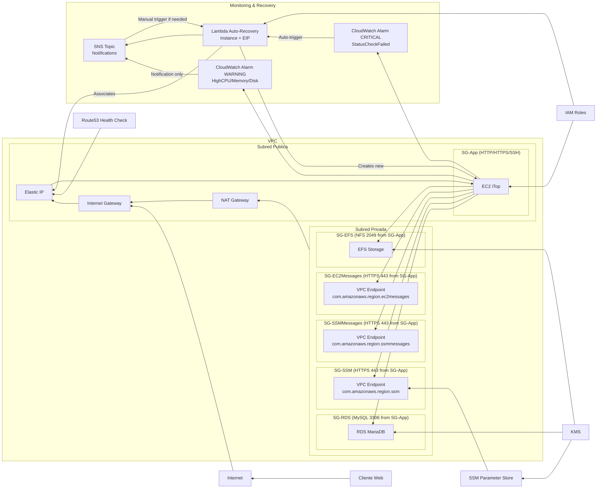

# packer-test

Proyecto para crear una AMI de iTop usando Packer.

## 1. Construcción de la AMI

### Inicializar plugins (primera vez)
```bash
packer init .
```

### Validar la configuración de Packer
```bash
packer validate .
```


### Construir la AMI
```bash
# Construcción básica
packer build .

# O usando archivo de variables específico
packer build -var-file="variables.pkrvars.hcl" .
```

## 2. Verificación de AMIs Creadas

### Listar las AMIs de iTop creadas
```bash
aws ec2 describe-images --owners self \
  --query 'Images[?starts_with(Name, `itop-server`)].{Name:Name,ImageId:ImageId,CreationDate:CreationDate}' \
  --output table
```

### Obtener el ID de la AMI más reciente
```bash
AMI_ID=$(aws ec2 describe-images --owners self \
  --query 'Images[?starts_with(Name, `itop-server`)] | sort_by(@, &CreationDate) | [-1].ImageId' \
  --output text)

echo "AMI ID: $AMI_ID"
```

## 3. Lanzamiento de Instancia de Prueba

### Configurar valores necesarios
Necesitarás ajustar estos valores según tu setup:
- `tu-keypair`: nombre de tu key pair
- `sg-xxxxxxxx`: security group que permita HTTP (80) y SSH (22)  
- `subnet-xxxxxxx`: subnet pública donde lanzar

### Lanzar la instancia
```bash
aws ec2 run-instances \
  --image-id $AMI_ID \
  --count 1 \
  --instance-type t3.medium \
  --key-name tu-keypair \
  --security-groups default \
  --associate-public-ip-address \
  --tag-specifications 'ResourceType=instance,Tags=[{Key=Name,Value=iTop-Validation-Test}]'
```

### Esperar que la instancia esté lista
```bash
aws ec2 describe-instances \
  --filters "Name=tag:Name,Values=iTop-Validation-Test" "Name=instance-state-name,Values=running" \
  --query 'Reservations[].Instances[].{InstanceId:InstanceId,PublicIP:PublicIpAddress,State:State.Name}' \
  --output table
```

### Guardar la IP pública
```bash
PUBLIC_IP="x.x.x.x"  # reemplaza con la IP real obtenida del comando anterior
```

## 4. Validación de la Instalación

### Conectar a la instancia
```bash
ssh -i ~/.ssh/tu-keypair.pem ubuntu@$PUBLIC_IP
```
### SSH Windows (Usando PowerShell)
```powershell
# Quitar herencia de permisos
icacls .\key.pem /inheritance:r

# Conceder solo permiso de lectura al usuario actual (reemplaza permisos existentes para ese usuario)
icacls .\key.pem /grant:r "%USERNAME%:R"

# Verificar permisos
icacls .\key.pem
```


### Verificar servicios (ejecutar dentro de la instancia)
```bash
# Verificar estado de servicios
sudo systemctl status apache2
sudo systemctl status mariadb  
sudo systemctl status php8.1-fpm

# Verificar que los puertos estén escuchando
sudo netstat -tlnp | grep :80
sudo netstat -tlnp | grep :3306
```

### Verificar archivos de iTop
```bash
# Verificar archivos de iTop
ls -la /var/www/html/
ls -la /var/www/html/setup/

# Verificar permisos
ls -la /var/www/html/ | grep -E "(conf|data|log)"
```

### Probar conectividad a base de datos
```bash
# Probar conectividad a MySQL
mysql -u itop_user -p -e "SELECT VERSION();"
# (usa la contraseña configurada en group_vars/itop.yml)
```

### Salir de SSH
```bash
exit
```

## 5. Pruebas Externas

### Probar acceso web
```bash
# Probar desde línea de comandos
curl -I http://$PUBLIC_IP/

# Debería devolver algo como:
# HTTP/1.1 302 Found
# Location: ./setup/index.php
```

## 6. Limpieza

### Terminar la instancia de prueba
```bash
# Terminar cuando hayas terminado las pruebas
aws ec2 terminate-instances --instance-ids i-xxxxxxxxx

# O mantenerla si quieres seguir probando
```
## 7. Diagrama de Arquitectura
