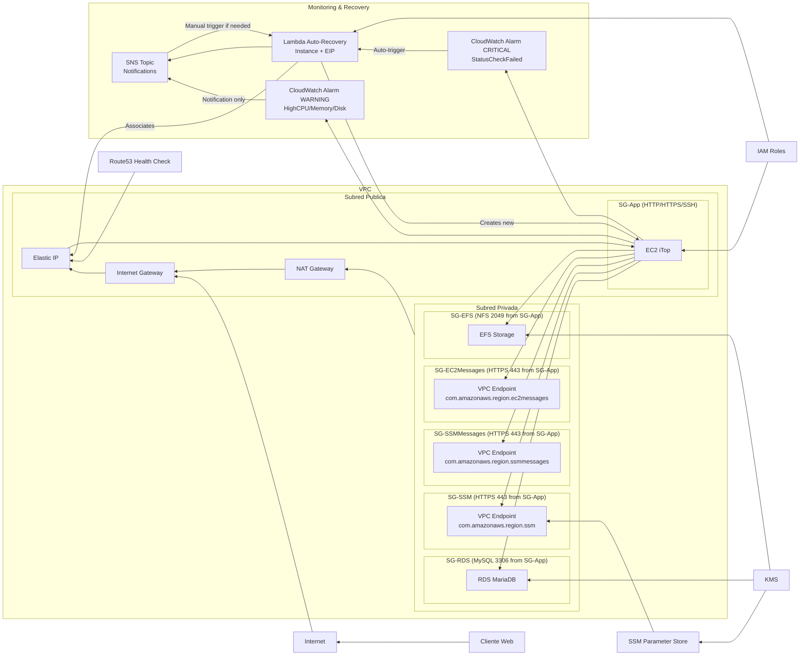

# iTop AMI con Packer y Terraform en AWS
Repositorio de prueba para construir una AMI personalizada de iTop usando Packer y lanzar una instancia EC2 con Terraform.

## 1. Configurar usuario de IAM en AWS

  1. `IAM` -> `Users` -> `Add user`
  2. Nombre de usuario: `your-username` -> Next
  3. Permissions options: Add user to group -> Next -> Create user
  4. Ve a `your-username`:
      - `Permissions` -> `Permissions policies`
      - `Add permissions` -> `Create inline policy` -> `JSON`
      - Ve a `/docs/packer-iam-policy.json`, copia el contenido y pégalo en el `Policy Editor`
      - Crea otra inline policy repitiendo el paso anterior pero esta vez:
        - Ve a `/docs/terraform-iam-policy.json`, copia el contenido y pégalo en el `Policy Editor`
  5. Ve a `your-username` -> `Security credentials` -> `Create access key`
      - Command line interface -> Next
      - Copia Access key ID y Secret access key
  6. En la terminal local ejecuta `aws configure` e ingresa las claves copiadas

Necesitarás ajustar estos valores según tu setup:
- `tu-ssh-keypair`: nombre de tu key pair
- `Packer`&`Terraform` instalado y configurado con `AWS CLI`
- Tener los permisos necesario para crear la infrastructura en AWS


## 2. Construir la AMI
```bash
# Inicializar plugins (primera vez)
packer init .

# Validar la configuración de Packer
packer validate .

# Construcción básica
packer build .

# O usando archivo de variables específico
packer build -var-file="variables.pkrvars.hcl" .
```

## 3. Lanzar la instancia
```bash
# Clonar el repositorio de Terraform
git clone https://github.com/keaguirre/terraform-itop-deploy

cd terraform-itop-deploy

# Inicializar Terraform
terraform init

# Aplicar la configuración (ajusta variables según tu setup)
terrafom apply --auto-approve -var="key_name=tu-ssh-keypair"

# Eliminar la infraestructura creada
terrafom destroy --auto-approve -var="key_name=tu-ssh-keypair"
```

## 4. Validación de la Instalación
Terraform al finalizar mostrará la IP pública de la instancia + el comando SSH para conectarse. Usa esa información para conectarte.

> [!NOTE]  
> Necesitarás la clave privada `.pem` asociada al key pair usado + permisos adecuados en el archivo `.pem`.
### Windows: 

  ```powershell
  # Quitar herencia de permisos
  icacls .\key.pem /inheritance:r

  # Conceder solo permiso de lectura al usuario actual (reemplaza permisos existentes para ese usuario)
  icacls .\key.pem /grant:r "$($env:USERNAME):R"

  # Verificar permisos
  icacls .\key.pem
```
### Linux:
```bash
# Ajustar permisos
chmod 400 ./key.pem

# Verificar permisos
ls -l ./key.pem 
```

## 5. Diagrama de Arquitectura
